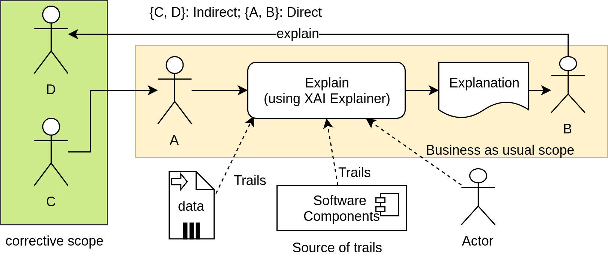

# Context-aware Machine Learning Explainability

## Explainability Requirements for ML Solutions in IoT Cloud Systems

In this work we focus on explainability requirements for ML solutions in IoT Cloud systems. The challenge is that End-to-end machine learning (ML) in Internet of Things (IoT) Cloud systems consists of multiple processes, covering data, model, and service engineering, and involves multiple stakeholders.

### Methodology - How do we identify and capture the requirements for explainability?

We develop a holistic approach in which explainability requirements should cover:
- multi-stakeholders
- multiple explainability aspects
- for an end-to-end ML system

#### Scoping stakeholders, ML processes, and explainability aspects

Scoping stakeholders: 
- Direct: explanation triggered through “explain” task, e.g., between developers for feature engineering and model training
- Indirect: following a chain of direct dependencies, e.g., BTS owner and MLOps team

Scoping ML Processes: 
- Identify processes/ tasks stakeholders responsible for or interested in
- Map stakeholders to relevant phases, covering ML requirement elicitation, service design, and development.
- Explainability for end-to-end ML preserves informative connection

Scoping ML explainability aspects: 
- Each stakeholder works/ supervises directly specific entities (data, ML models, etc.).
- Overall, a wide range of entities, and associated constraints (metrics and aspects)
- Analyzing their role in each process/task => requirements and constraints
#### Explainability requirements elicitation

In order to sufficently collect and document stakeholders' requirements, we recommend:

 (1) identify concrete individual stakeholders 

 (2) collect their requirements through survey or interview

 (3) continue to update their requirements as the development progresses, e.g. every sprint if the Agile development method is employed

## Publications
- My-Linh Nguyen, Thao Phung, Duong-Hai Ly, Linh Truong, ["Holistic Explainability Requirements for End-to-end ML in IoT Cloud Systems"](https://research.aalto.fi/en/publications/holistic-explainability-requirements-for-end-to-end-machine-learn), 2021 IEEE 29th International Requirements Engineering Conference Workshops (REW), First International Workshop on Requirements Engineering for Explainable Systems (RE4ES), Accepted/In press - 2021

